# COMPLETE GUIDE DOCKER & KUBERNETES from [STEPHEN GRIDER]

This course from Stephen teach how to create and deploy any web apps into a Web
services.

# What is Docker?

Docker is a platform or ecosystem around creating and running containers
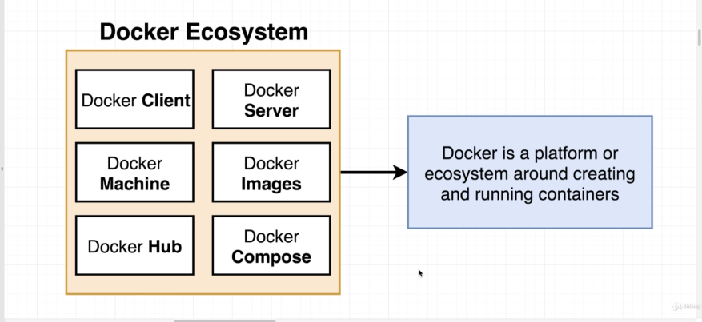

# Why use Docker?

Docker wants to make it really easy and straight forward for run software or
install in any computer as in webserver as well without worrying about all bunch
of setup or dependencies.

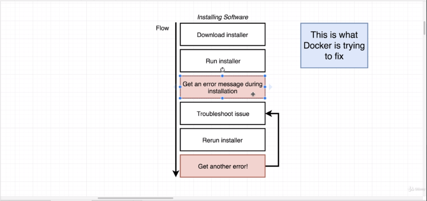

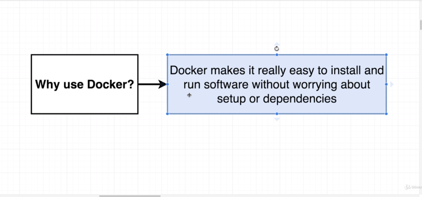

# What is an Image in Docker?

Single file with all the dependencies and config or setup required to run
a very specific program.

for example a NODEJS, NGINX, or REDIS etc

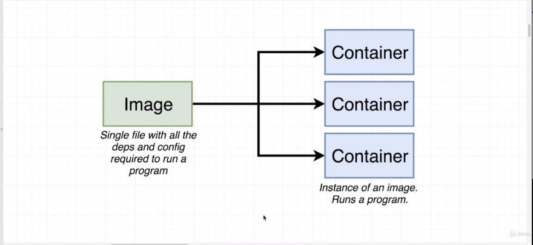

# What is a Container in Docker ?

Is a instance of an Image to runs a program.

It's a program with his own isolated set of hardware resources, it has own set
of memory, it has own space of networking technology, it has own spcae of
hard-drive.

# == Manipulating Containers with the Docker Client ==

## 001. Docker Run in Detail

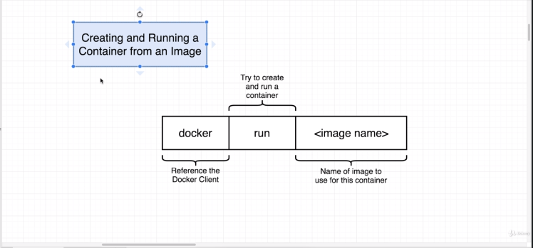

eg:
```
docker run hello-world
```


## 002. Overriding Default Commands

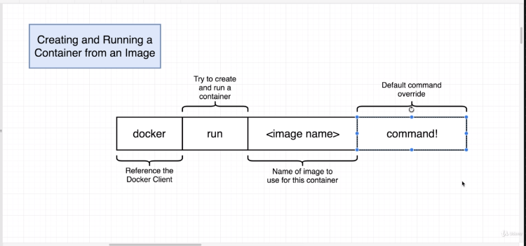

eg:
```
docker run busybox echo hello world!
```

## 003. Listing Running Containers

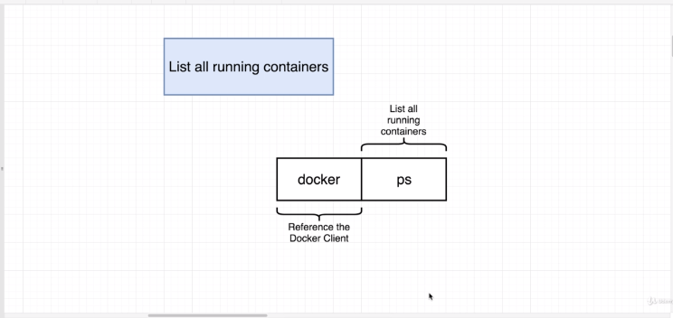

eg:
```
docker ps

#or

docker ps --all
```

## 004. Container Lifecycle

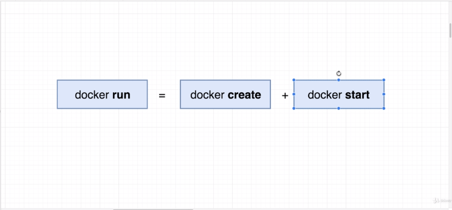

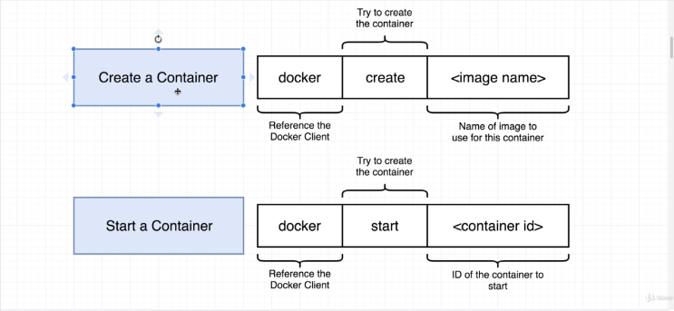

eg:
```
# create a container

  docker create redis

# start a container

  docker start 4b263884282
```

## 005. Restarting Stopped Container

eg:
```
docker start -a 4b263884282
```

## 006. Removing Stopped Containers

eg:
```
docker system prune
```

## 007. Retrieving log Outputs


eg:
```
docker log 4b263884282
```

## 008. Stopping Containers

stop command use to take more time for shutdown the container.

kill command use to shutdown the container immediately.

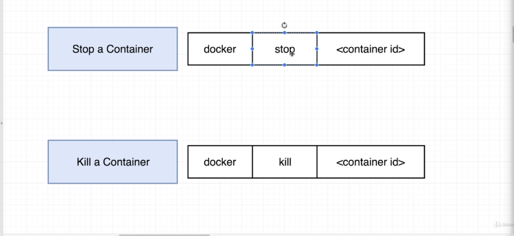

## 009. Multi-command Containers

we have two separate containers. we want to include redis-cli container into
redis-server container to run together

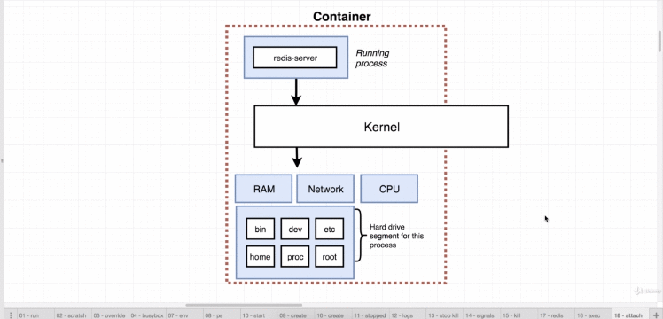

## 010. Executing Command in Running Containers

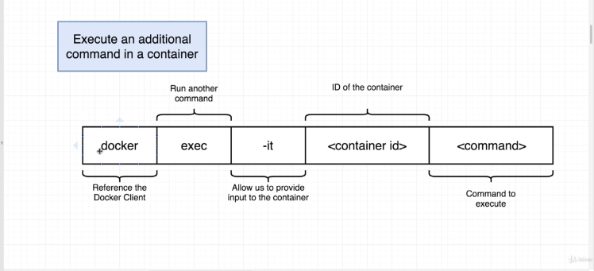

eg:
```
docker exec -it 4b263884282 redis-cli
```

## 011. The Purpose of the IT flag

When you running docker on your computer or machine every single container you
are running is running inside a virtual machine running Linux.

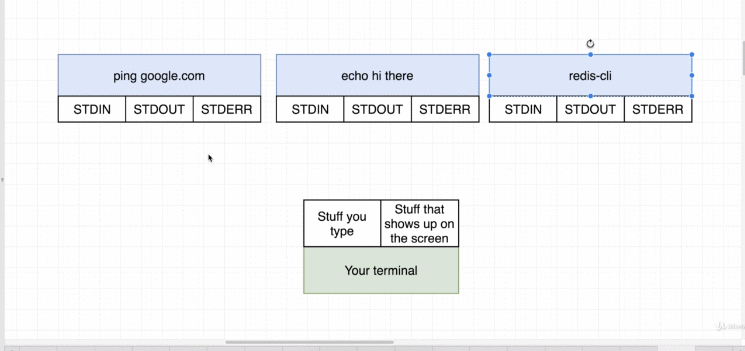

The IT flag is two separate flag

```
-it

# or

-i -t

 -i, --interactive          Keep STDIN open even if not attached
 -t, --tty                  Allocate a pseudo-TTY | make sure all the text nicely format | auto-complete
```

## 012. Getting a Command Prompt in a Container

You will not want to execute without having execute same command.

"sh" is a command processor or a shell its allow to type command in and will be
execute inside the container.


eg:
```
docker exec -it 4b263884282 sh
```

## 013. Starting with a Shell

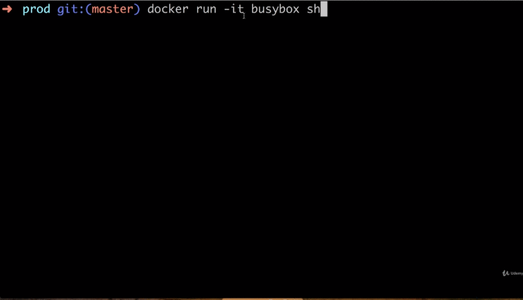

## 014. Container Isolation

The containers do not automatically share their files system

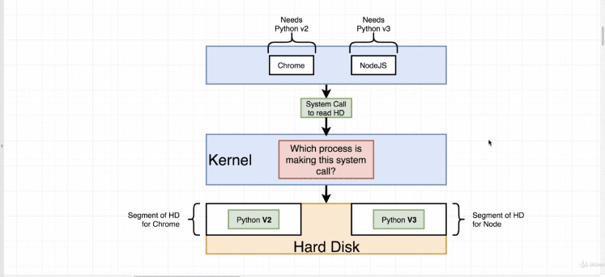

# == Building Custom Images Through Docker Server ==

## 015. Creating Docker Images

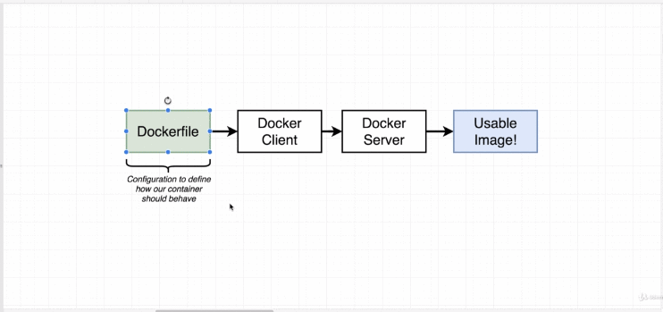

## 016. Building a Dockerfile

[redis-image Dockerfile](./redis-image/Dockerfile)

## 017. Dockerfile Teardown

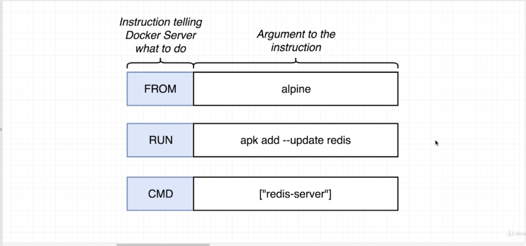

## 018. What's a Base Image

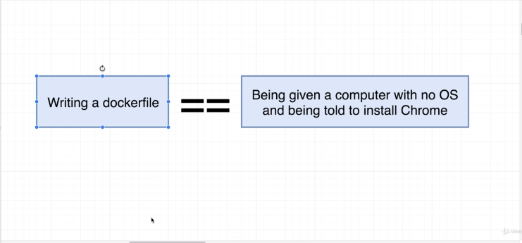

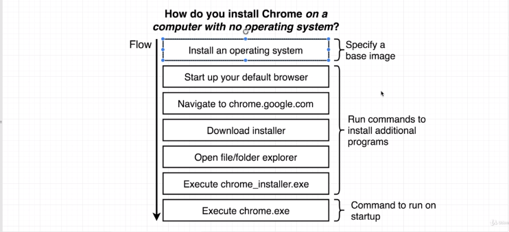

## 019. The Build Process in Details

why use new command?
```
docker build .
```

the build command it's will be use to take docker file and generating it


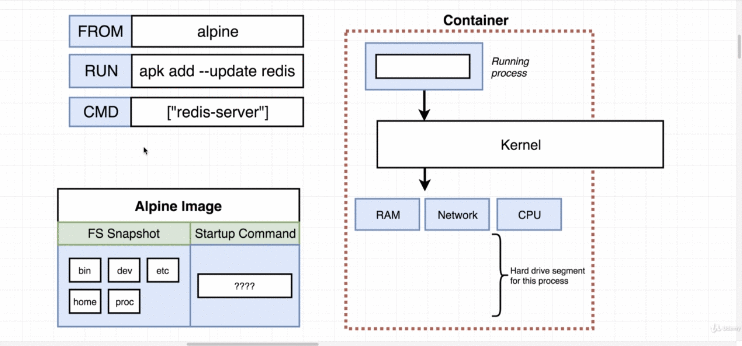

## 020. A Brief Recap

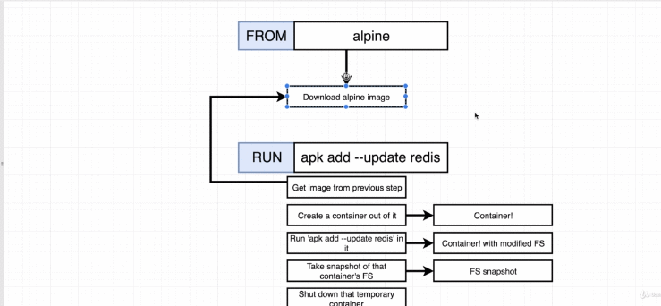

## 021. Rebuild with Cache

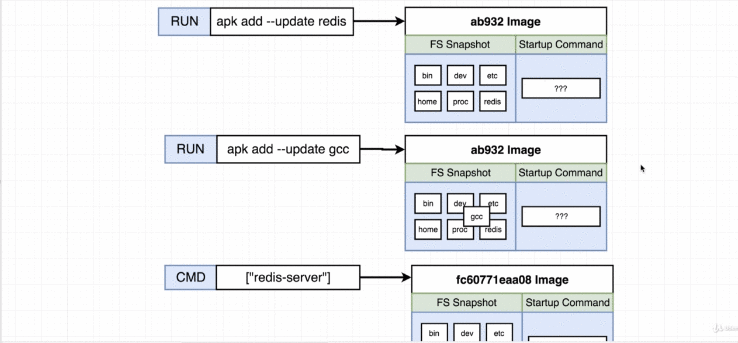

## 022. Tagging an Image

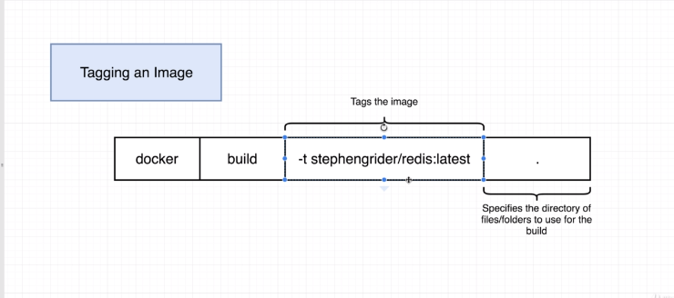

the convention to tagging an Image


eg:
```
docker build -t localhost/redis:latest .

# and run

docker run localhost/redis
```

## 023. Manual Image Generation with Docker Commit

In common, we use image to create container. We can manually create a container
runs command inside container and generate an image. In straight word we can do
manually the same thing Dockerfile does.

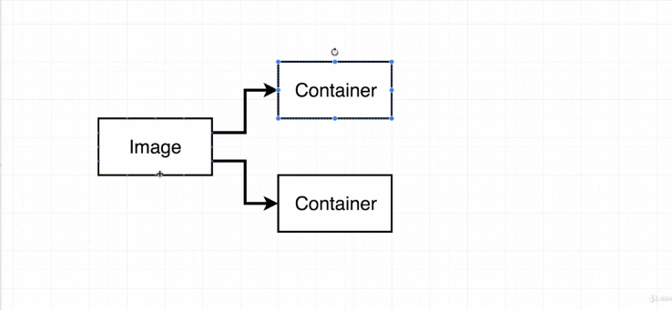

eg:
```
# IMPORTANT YOU DON'T WANT USE THIS WAY IN GENERAL
# BETTER USE Dockerfile APPROACH

docker commit -c 'CMD["redis-server"]' 4b263884282
```

# == Making Real Projects with Docker ==

## 024. Making Real Projects with Docker

[simple-web](./simple-web/)

## 025. Base Image Issues

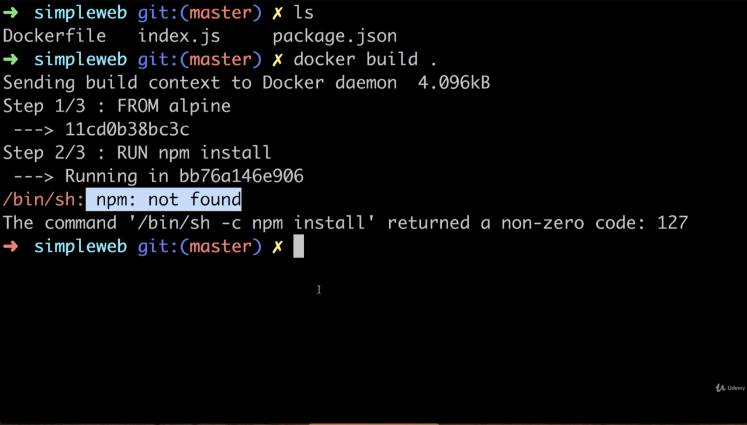

To solve the issue "npm not available on a base image"

~~~
#Dockerfile
FROM node: alpine
~~~

alpine is a term in docker role for a small incompact images. Many popular
repository were going to offer alpine version of their images.

## 027 A few Missing Files

None of the files inside your root directory are available inside the container by
default. Completely segmented out unless you specifically allowed inside your
Dockerfile.

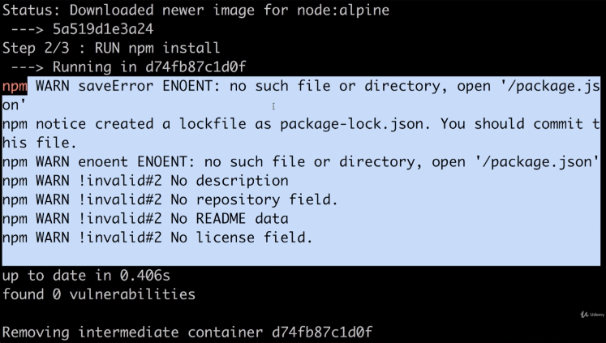

To solve 'no such file or directory'

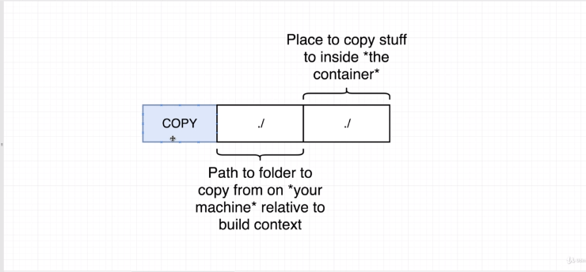

eg:
~~~
#Dockerfile
# Install some dependencies

COPY ./ ./

#Default command
.....
~~~

## 028. Container Port Mapping

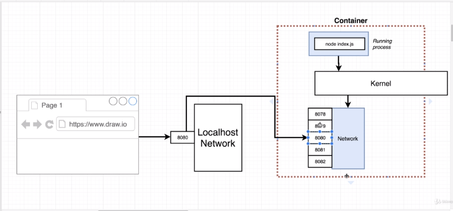

We do not setup port-porting inside Dockerfile, a port-porting stuff is strictly
a run time constrain, in other words its something we only change when we run
a container or start a container.

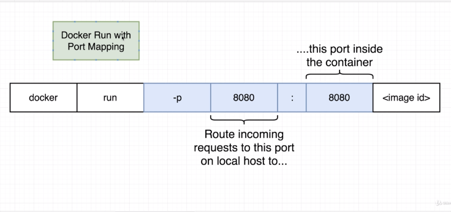

eg:
~~~
docker run -p 8080:8080 localhost/simpleweb
~~~

## 029. Specifying a Working Directory

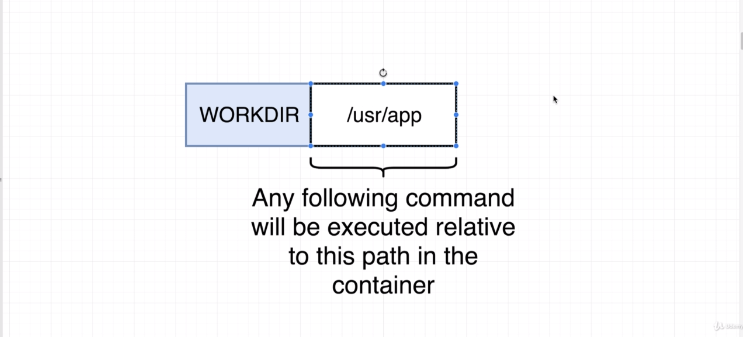

eg:
~~~
# Dockerfile

WORKDIR /usr/app
~~~

to check the working directory is no longer in image root directory we can check by

eg:

~~~
#open 1st cli
docker run -p 5001:5001 <initial-name>/<initial-docker-container>

#open 2nd cli to check
docker exec -it <id-container> sh
~~~

## 030. Unnecessary Rebuilds
how to avoid having completely reinstall all dependencies just because we made
a change in source code file?

eg:
~~~
#Dockerfile

COPY ./package.json ./    #just copying current specify directory to WORKDIR directory
RUN npm install           # just run once

COPY ./ ./                # copy over everything else except package.json
~~~

# == Docker Compose with Multiple Local Containers ==

## 031. Introducing Docker Compose


## 032. Docker Compose Files

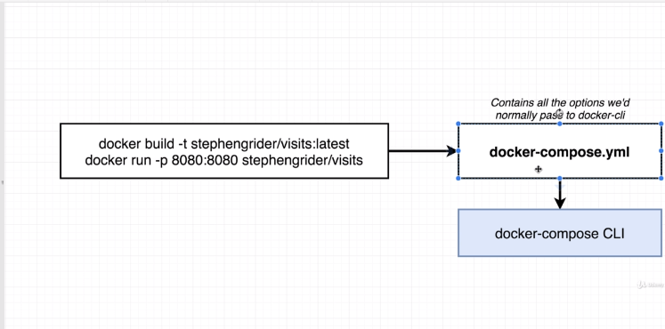

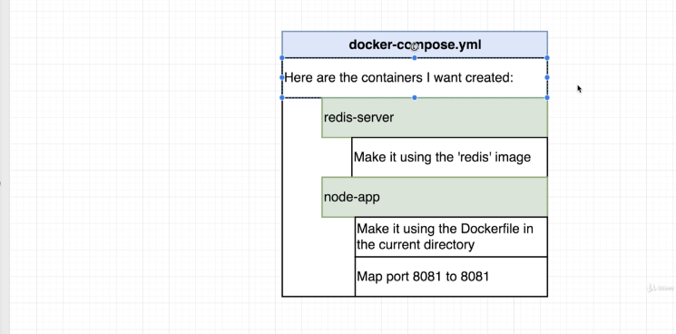

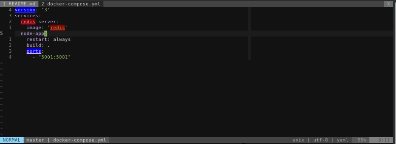

## 033. Networking with Docker

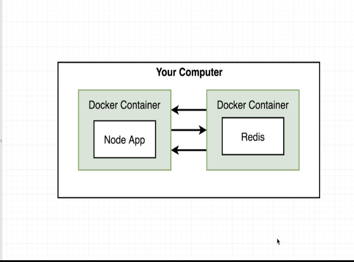

~~~
#docker-compose.yml
services:
  redis-server:     # 1st image
    image: 'redis'
  node-app:         # 2nd image
    ...
    ...
    ...

## app.js
const client = redis.createClient({
  // add docker images
  host: 'redis-server',
  // default redis-server
  port: 6379                # specify port for redis-server
});
~~~

## 034. Docker Compose Command

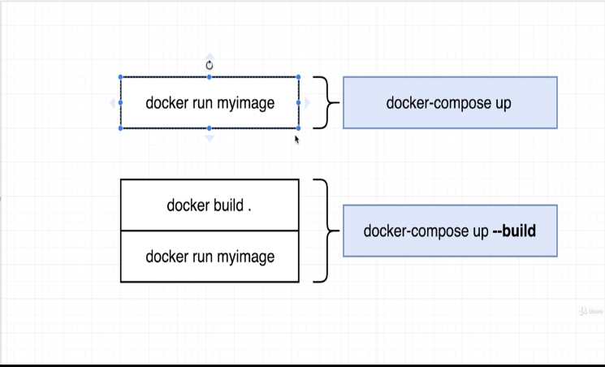

## 035. Stopping Docker Compose Containers

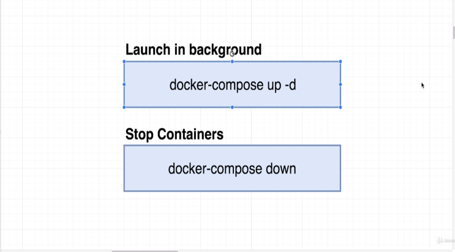

## 036. Container Maintenance with Compose


~~~
#docker-compose.yml

version: '3'
services:
  redis-server:
    image: 'redis'
  node-app:
    restart: always       # Restart Policies
    build: .
    ports:
      - "5001:5001"
~~~

## 037. Container Status with Docker Compose

eg:
~~~
#in cli with folder related docker-compose.yml
docker-compose ps
~~~

# == Creating a Production-Grade Workflow ==

## 038. Development Workflow

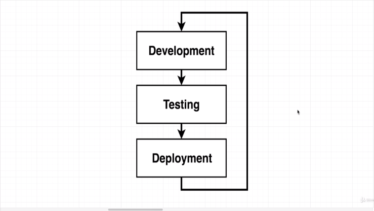

## 039 flow Specifics

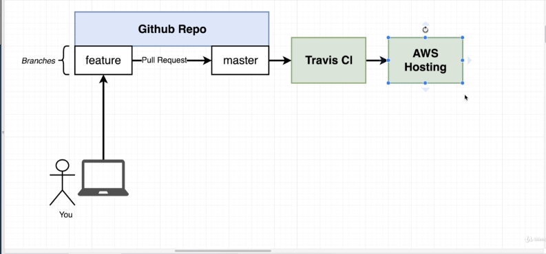


## 040. Docker Purpose

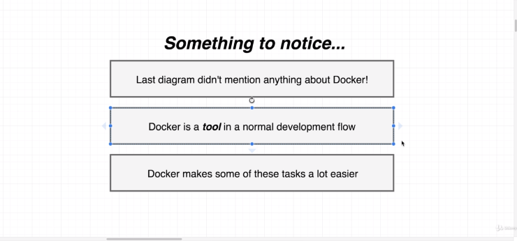


## 041. Creating the Dev Dockerfile

eg:
~~~
#create Dockerfile.dev in root folder directory

#run in cli
docker build -f Dockerfile.dev -t "<images-name>/<container-name>:latest" .    # -f is stand for looking a specify Dockerfile
~~~

## 042. Duplicating Dependencies

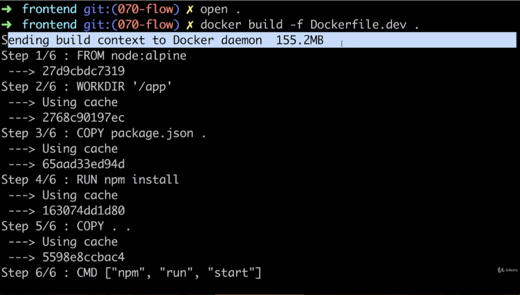

to solve this problem, just delete __node_modules__ on root folder.

~~~
.
├── node_modules    # Delete this for avoid duplicate files in images
├── public
└── src
~~~

## 043. Docker Volumes
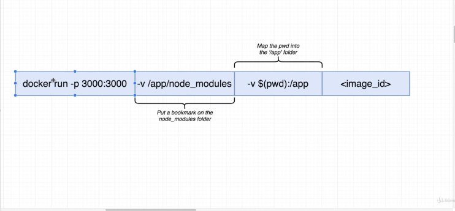

~~~
-v $(pwd):/app

-v        # volume list | Bind mount a volume
$(pwd)    # pwd stand of "present working directory"
:/app     # when we use a ":" we want to map out a folder inside the container to the folder outside container

-v /app/node_modules  # just a placeholder for the folder that's inside the container
~~~

## 044. Shorthand with Docker Compose

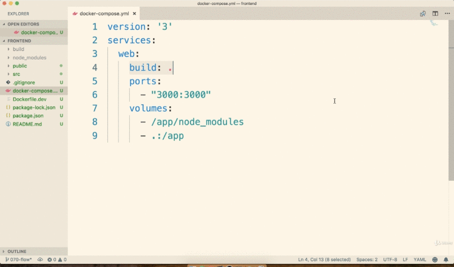

## 045. Live Updating Tests

~~~
# open 1st cli
docker-compose up   # to build an image

# open 2nd cli
docker ps   # to copy the run CONTAINER-ID

docker exec -it <container-id> npm run test
~~~

## 046. Docker Compose for Running Tests

~~~
# docker-compose.yml
# add this code
version "3"
  services:
  ....
  ....
  ....
  # for test purpose
  test:
    build:
      context: .
      dockerfile: Dockerfile.dev
    volumes:
      - /app/node_modules
      - .:/app
    # override command to run test
    command: ["npm", "run", "test"]

# run cli
docker-compose up --build
~~~

## 047. Multi-Step Docker Build for Production environment

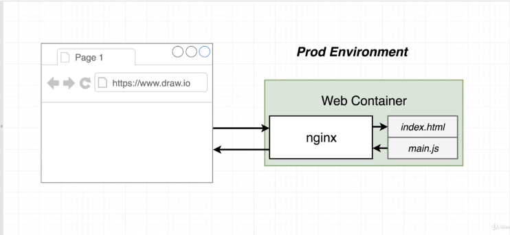

but we have an issue here,

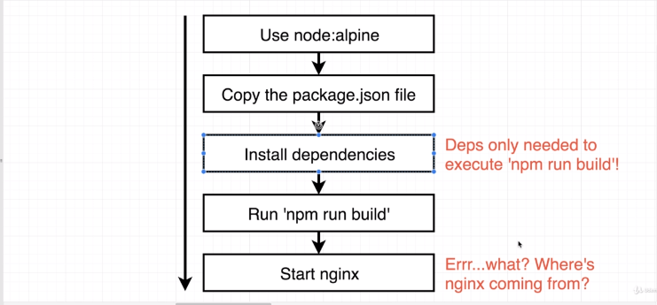

so we make two different images to solve this issue.

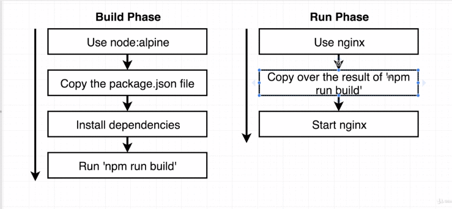

## 048. Implementing Mutli-Step build

[Dockerfile for production env](./frontend/Dockerfile)

## 049. Running Nginx

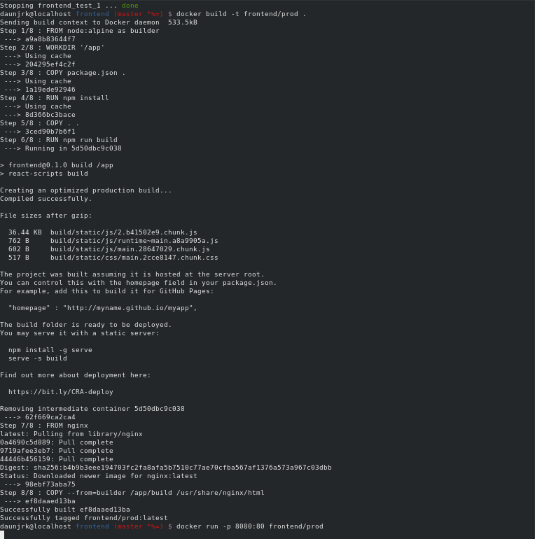

# == Continuous Integration and Deployment with AWS ==

## 050. Travis CI Setup

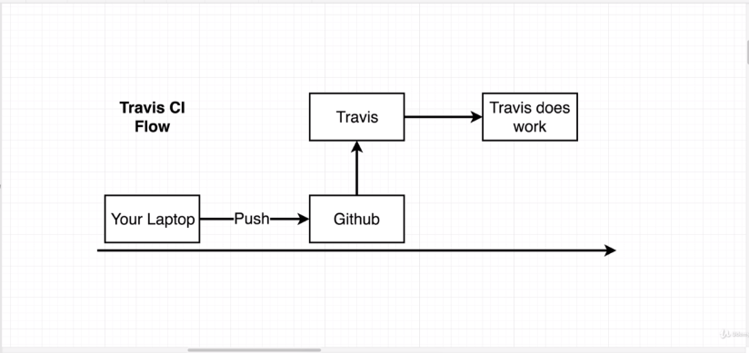

### What is Travis CI?

**Travis CI** is a hosted, distributed continuous integration service used to
build and test projects hosted at Github. **Travis CI** automatically detects
when a commit has been made and push to a Github repository that is using
**Travis CI**, and each time this happen, it will try to build project and run
test.

## 051. Travis YML file Configuration

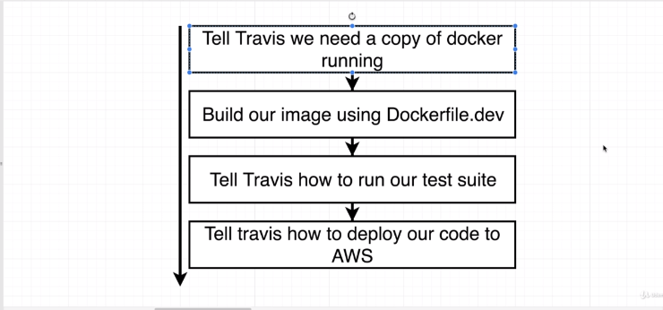

[.travis.yml file](./frontend/.travis.yml)

~~~
#.travis.yml

script :
  - docker build -e CI=true -t <images-name>/<container-name>:<env> npm run test -- --coverage

# added a options
-- --coverage   # to make automatically run command exit

-e CI=true      # it tells docker the env list
~~~

## 052. AWS Elastic Beanstalk


The benefit of using **Elastic Beanstalk** is monitors the amount of the traffic
that come into our virtual machines and automatically scale everything up.

## 053. Travis Config for Deployment

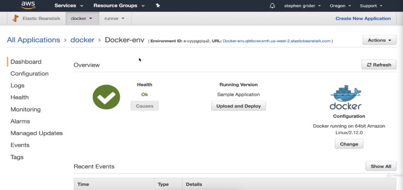

for bucket_name:

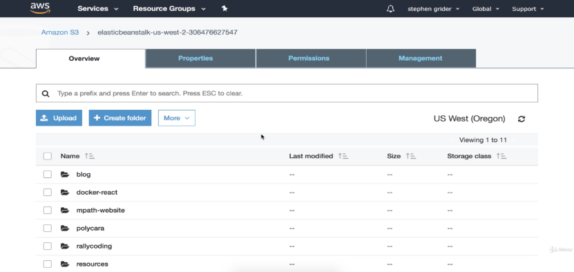
eg:
~~~
# add this into .travis.yml

deploy:
  provider: elasticbeanstalk
  region: "us-west-2"                                             # the region you choose
  app: "docker"                                                   # a name that you setup in aws
  env: "Docker-env"                                               # a name that revere as the environment
  bucket_name: "elasticbeanstalk-us-west-2-<your-app-id>"
  bucket_path: "docker"                                           # the name same as app names
  on:
    branch: master
~~~

## 054. Automated Deployments

Set an API_KEYS to give access to our aws account over Travis-CI.

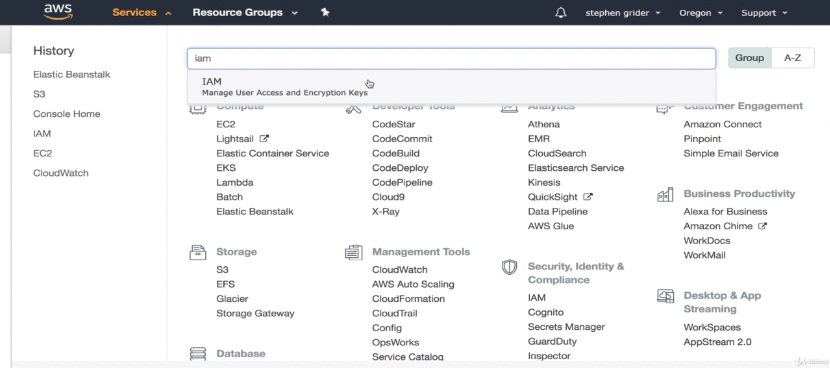

At travis CI add your access_key_id and secret_access_id,

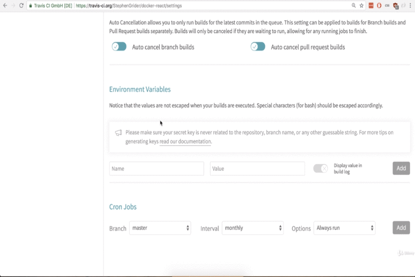
~~~
# add this into .travis.yml

deploy:
  provider: elasticbeanstalk
  region: "us-west-2"                                             # the region you choose
  app: "docker"                                                   # a name that you setup in aws
  env: "Docker-env"                                               # a name that revere as the environment
  bucket_name: "elasticbeanstalk-us-west-2-<your-app-id>"
  bucket_path: "docker"                                           # the name same as app names
  on:
    branch: master
  # a new line setting
  access_key_id: $AWS_ACCESS_KEY
  secret_access_key:
    secure: "$AWS_SECRET_KEY"                                     # make sure you put double quote
~~~

## 055. Exposing Ports Through the Dockerfile | for production-env deployment

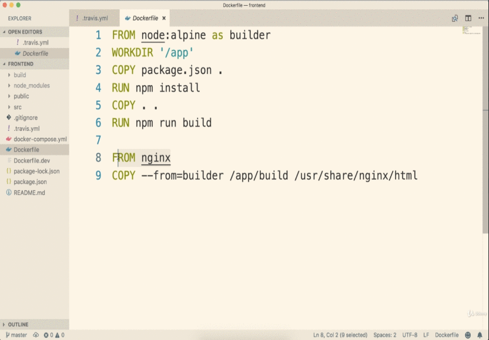
~~~
# at Dockerfile | production-env

EXPOSE 80   # is a communication for each developers
~~~

if you hit an error when deploy to aws, maybe you forget to config EXPOSE at Dockerfile

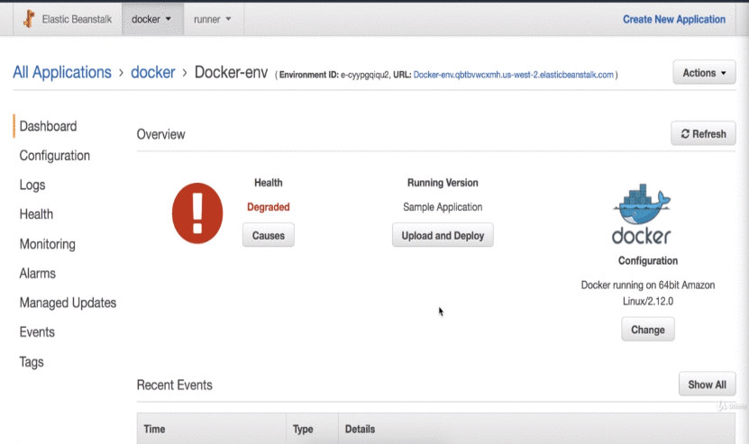

At *aws-elascticbeanstalk* is little bit different , *elasticbeanstalk* when it's
start up docker container is gonna look at **Dockerfile** and gonna look to
**EXPOSE** instruction, and what ever port you listed in there, is what
*elasticbeanstalk* is going to map directly automatically.

## DONT FORGET TO TERMINATE the ELastic Beanstalk app! for AWS not charge some money

# == Building a Multi Container Application ==

## 056. Single Container Deployment Issues

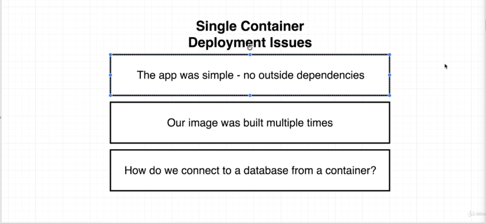

### THIS IS A BAD APPROACH
We build the images multiple times, we build out our images over **travis-CI**
when we run our task, and we also build image a second time after we push all
over code through **travis-CI** over to **Elastic Beanstalk**. This is not the
best approach because we essentially taking web-server or web-apps and we using
it to build the images, chance are we really want the web-server to be just
**concern running the web-server** and not to take any extra process of building
images. So we concern to not allow the images to build in active running
web-server.

## 057. Application Overview

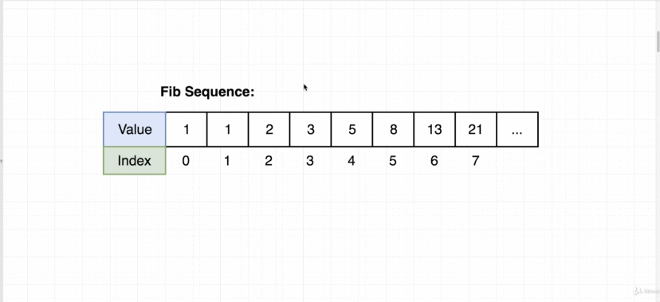

## 058. Application Architecture | Backend Architecture

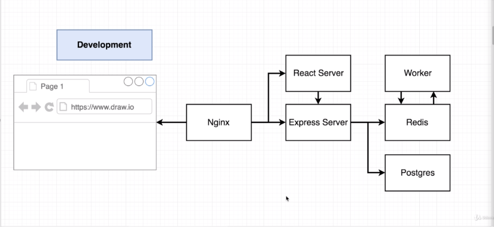

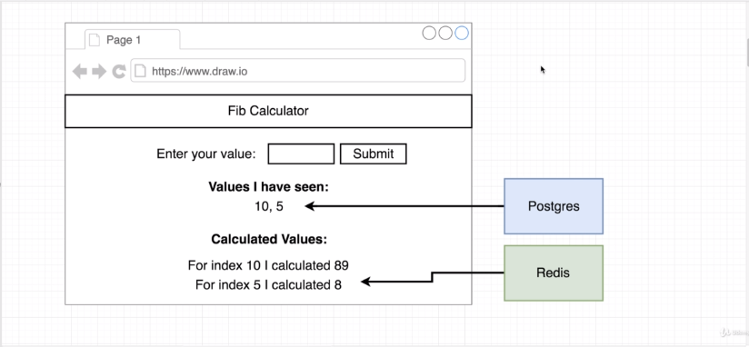
~~~
Nginx               # to do some routing
React Server        # get some front-end mockup | assets
Express Server      # to set backend API
Worker              # a separate backend NodeJS process
Redis               # a memory data-store for housing temporary value
Postgres            # a database which is very similar with mysql
~~~

### a flow behind the scene

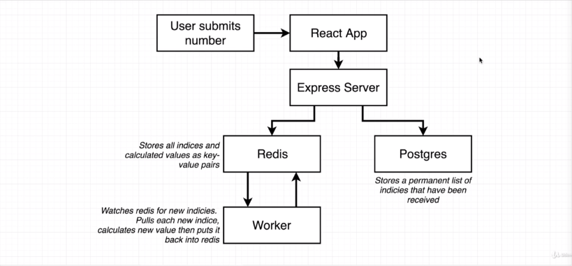

# == Dockerizing Multiple Service ==

## 059. Dockerizing a React App - Again!

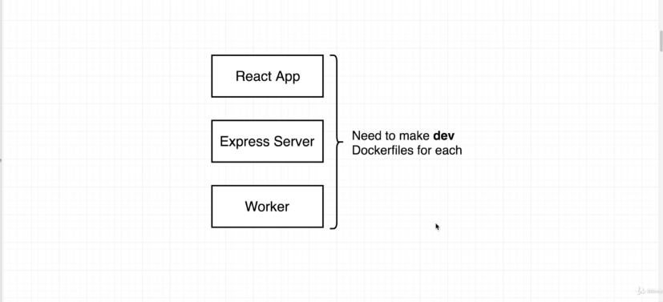

The purpose is to make **dev** Dockerfiles for each one is if we make a change
**client**, **server**, **worker** we ensure to not rebuild the entire images to
get changes into a fact that makes really slow development workflow.

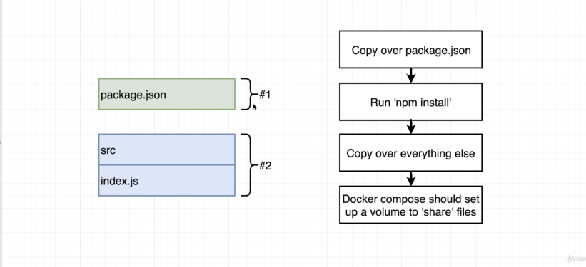

## 060. Adding Postgres as a Service

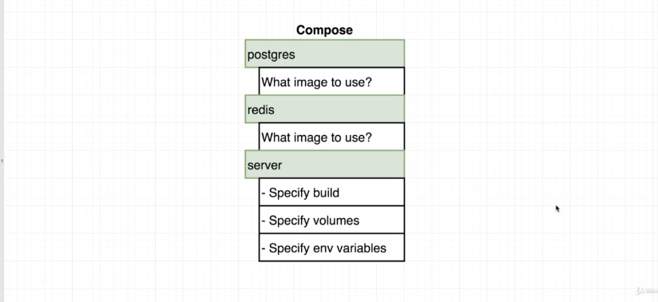

eg:
~~~
# create docker-compose.yml file on complex root dir and write on it:

version: '3'
services:
  postgres:
    image: 'postgres:latest'
    container_name: postgres-complex
~~~
or see:

[docker-compose.yml](./complex/docker-compose.yml)

## 061. Environment Variables with docker-compose

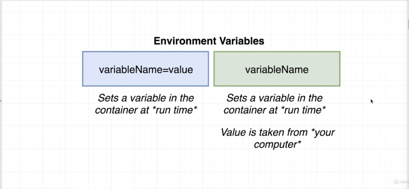

```
variableName=value
```

when you use this command its mean you run 2 step process,

1. first step process
  you build an images, that's kind of preparation part create a new images.

2. second step process
  when some point on the future we run a container, we actually take an
  images and create instance of container out of it.

```
variableName
```

So if you have env-var setup on your machine like some secret API-KEY that maybe
you want to use this syntax

## 062. Nginx Path Routing

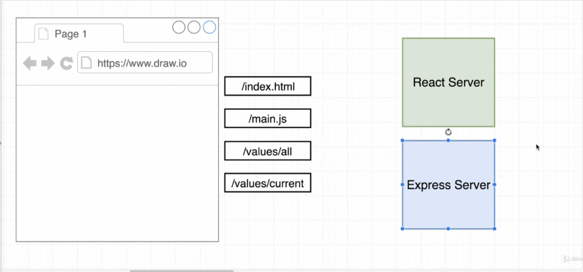

## 063. Routing with Nginx
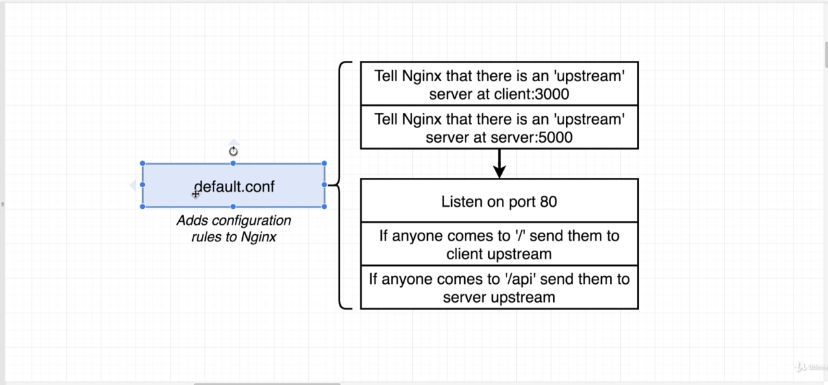

or see the files:

[nginx-route-default.conf](./complex/nginx/default.conf)

# == A Continuous Integration workflow for Multiple Images ==

## 063. Production Multi-container Deployment

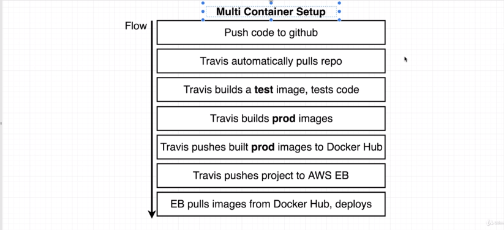

## 064. Multiple Nginx Instances

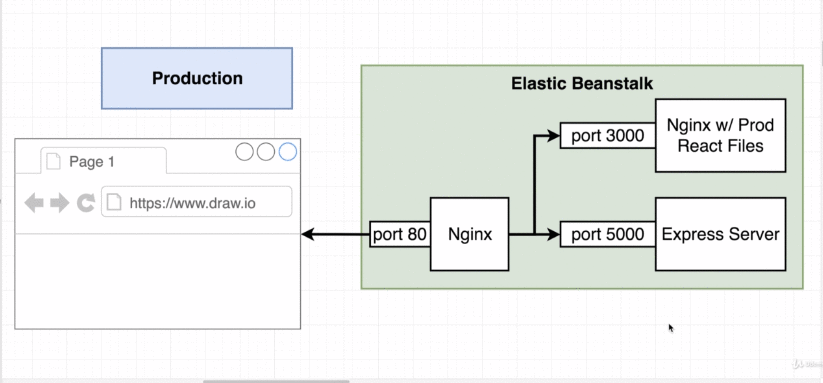

## 065. Altering Nginx's Listen Port

On production environment nginx server has to listen on port **3000**

## 065. Travis Configuration Setup

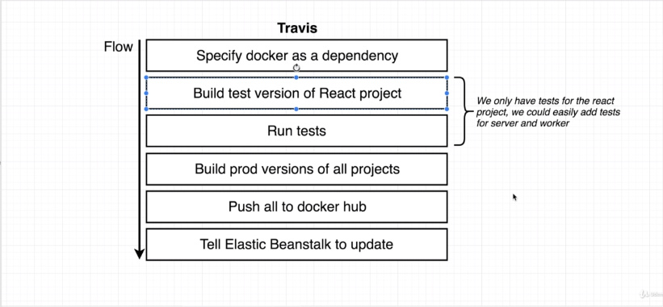

[.travis.yml](./complex/.travis.yml) for multi-images

## 066. Pushing Images to Docker Hub

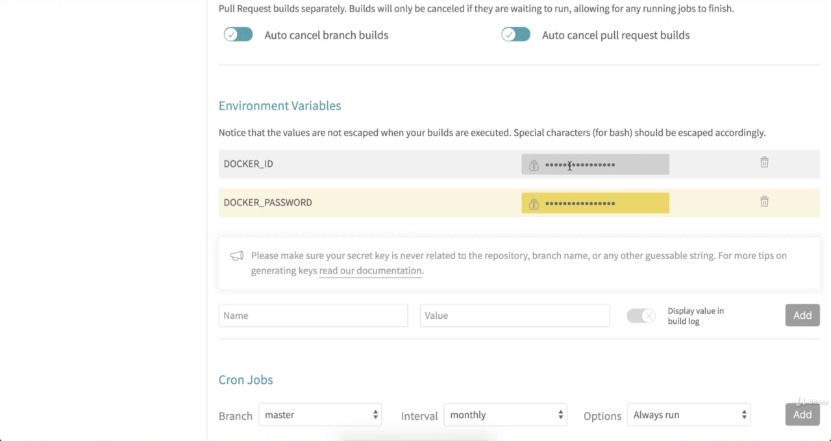

eg:
``` yaml
# in .travis.yml
# ATTENTION ON DETAIL
# change <your-docker-username> as your docker profile

after_success:
  - docker build -t <your-docker-username>/multi-client ./client
  - docker build -t <your-docker-username>/multi-nginx ./nginx
  - docker build -t <your-docker-username>/multi-server ./server
  - docker build -t <your-docker-username>/multi-worker ./worker

# Log in to docker CLI
  - echo $"DOCKER_PASSWORD" | docker login -u "$DOCKER_ID" --password-stdin

# Take those images and push them to docker hub
  - docker push <your-docker-username>/multi-client
  - docker push <your-docker-username>/multi-nginx
  - docker push <your-docker-username>/multi-server
  - docker push <your-docker-username>/multi-worker
```

# == Multi Container Deployment to AWS ==

## 066. Multi Container Definition Files

We have a couple different folder in each of them has a separate a Dockerfile,
so any time we want to run multiple separate containers on **AWS EB** we need to
create a special file.

The new file going to be a JSON file, that to tell **EB** exactly where to pull
images from, what resources to allocate for each one, how to setup
a port-mapping, and some associated information.
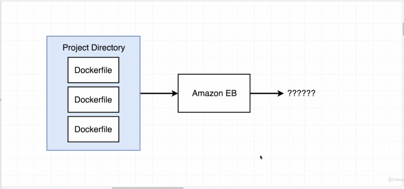

#### What is the different between *docker-compose.yaml* and *Dockerrun.aws.json*?

**docker-compose.yaml** have direction how to build an images and
**Dockerrun.aws.json** the image has been build just specify images to use.

```
AWS EB      # AWS ELASTIC-BEANSTALK
```

## 067. Finding Docs Container Definitions

Is not immediately clear when you start reading AWS documentation to how to
customize **Dockerrun.aws.json**. So lets look the AWS documentation,

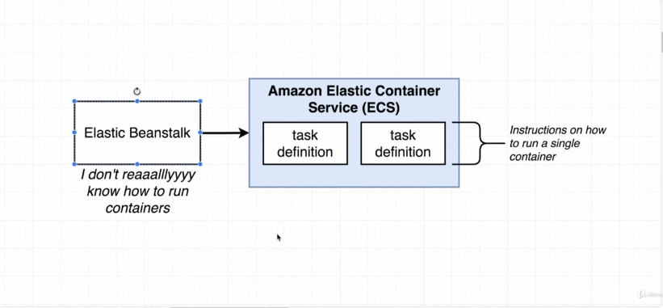

```json
#Dockerrun.aws.json
{
"AWSEBDockerrunVersion":2,
  "containerDefinitions": [
    {
      "name": "client",
      "image": "<your-docker-id>/multi-client",
      "hostname": "client",      # it's name same at your docker-compose.yml services
      "essential": false         # if we remakrs with true and this container ever crashes all the other container in this group will be close-down
    },
    {
      "name": "server",
      "image": "<your-docker-id>/mulit-server",
      "hostname": "api",          # renaming hostnmae from server, cause Nginx try to redirect traffic upstream
      "essential": false
    },
    {
      "name": "worker",
      "image": "<your-docker-id>/multi-worker",
      "hostname": "worker",
      "essential": false
    },
    {
      "name": "nginx",
      "image": "<your-docker-id>/multi-nginx",
      "hostname": "nginx",       # just optional require because no other services need to directly access nginx
      "essential": true,         # if this container crash with any reason all container  must be automatically shutdown at the same time
      "portMappings": [
        {
          "hostPort": 80,        # open up a port on the host or on the machine
          "containerPort": 80    # default nginx mapped port from host
        }
      ],
      "links": ["client", "server"] # forming links from nginx over to the client container and server container
    }
  ]
}
```
## 068. Forming Container Links

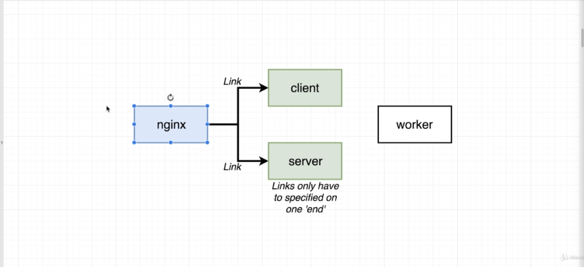

## 069. Creating the EB Environment

!! **ATTENTION** when you create a project without a free-plane, make sure you
**DELETE** any project or AWS will charge any instances.


## 070. Managed Data Service Providers

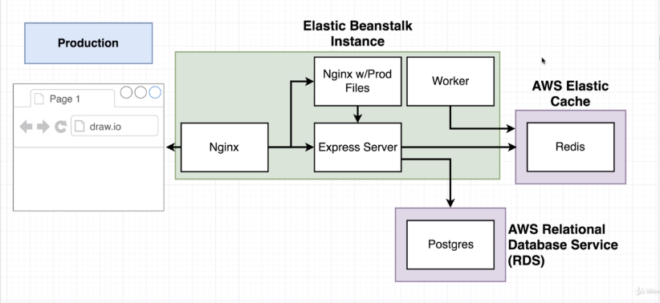

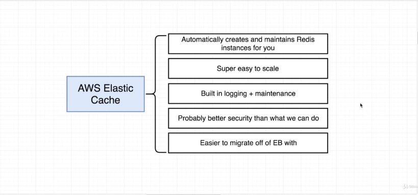

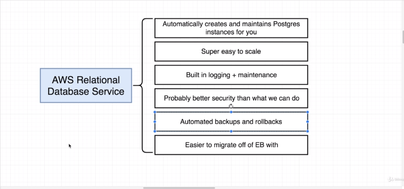

## 071. Overview of AWS VPC's and Security Groups

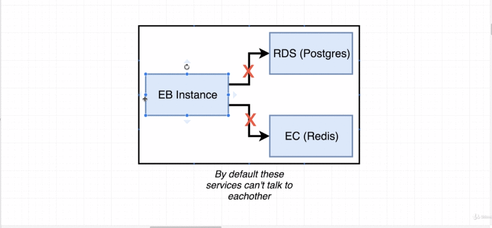

```
VPC     # Virtual Private cloud
```
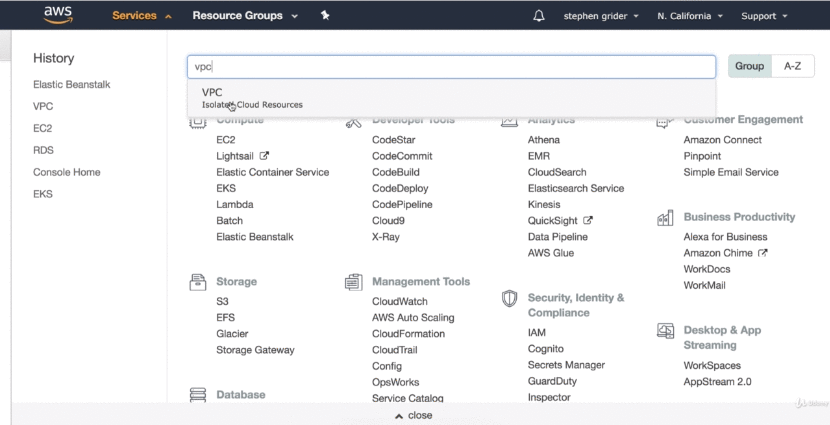

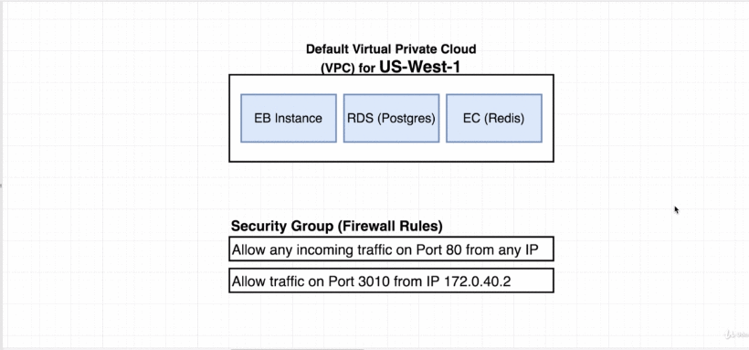

**Security Group (firewall Rules)**: is a rules describing what different
services or sources of internet traffic can connect to different services
running inside your **VPC's**


**Q**: Now we understand what **VPC's** is and **Security Group** is, how are we
going to form a connection between **EB Instance** with **RDS (Postgress)** and **EC
(Redis)**?

**A**: we gonna create a new security group, and new security group is going to
say essentially as a rule let any traffic access this instances if it belong to
the security group and we gonna attached it to all three of this different
services. So all the services is gonna belong to this one common security group.
And Security group essentially says if another AWS instance belong to a new
security group then let the traffic flow through and let different services talk
to each other.

## 072. RDS Databases Creation

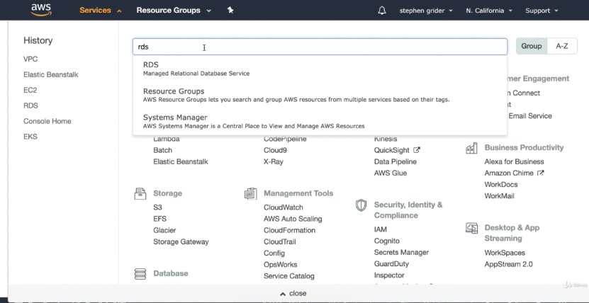

## 073. ElastiCache Redis Creation

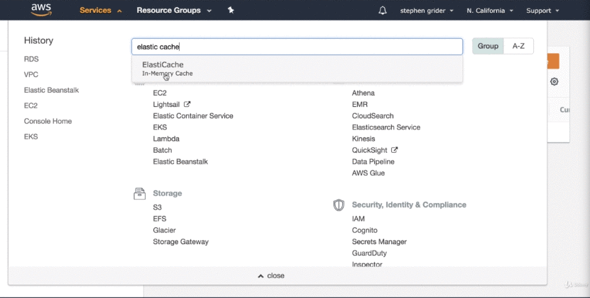

## 074. Creating a Custom Security Group

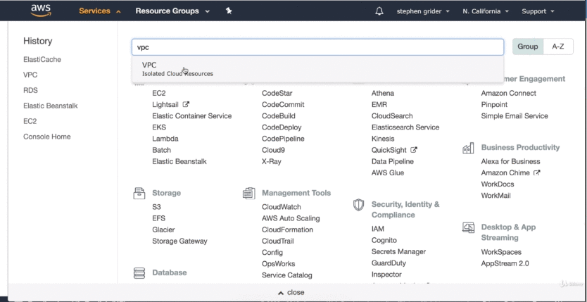

```
rds-launch-wizard   # a new security group automated created when you make postgress instances
```

## 075. Applying Security Groups to Resources

**ElastiCache (redis)**

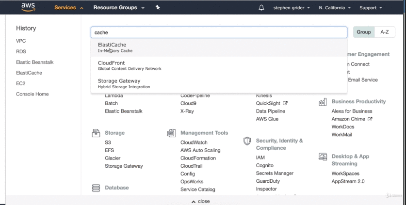

**AMAZON RDS (Postgres)**

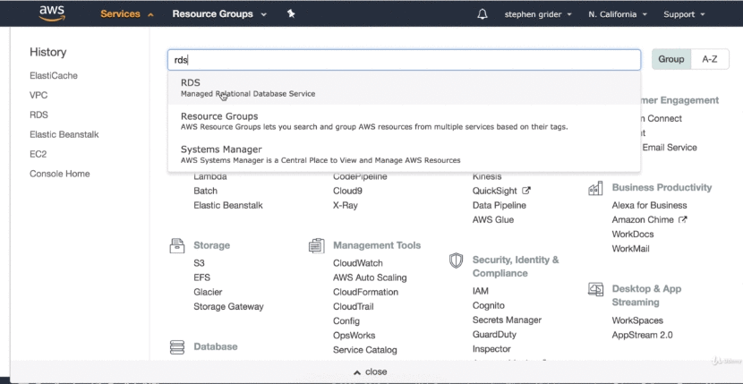

**EB Instances**

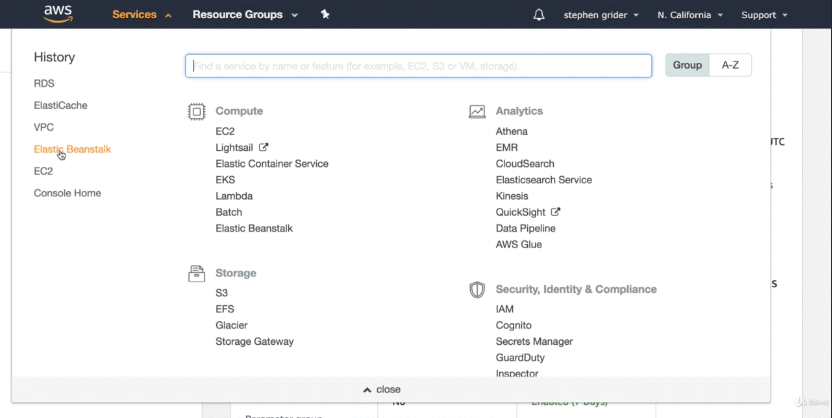

## 076. Setting Environment Variables

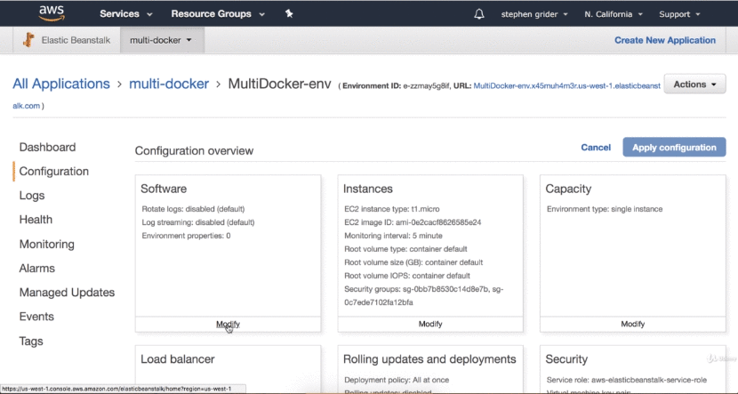

**ATTENTION**
- When you put your Environment properties in **EB** the values didn't hidden, so
when you entry properties, potentially other people come to this page can see
database password.

- ElastiCache Redis at **Primary Endpoint**, we do not copy the port.

## 077. IAM Keys for Deployment

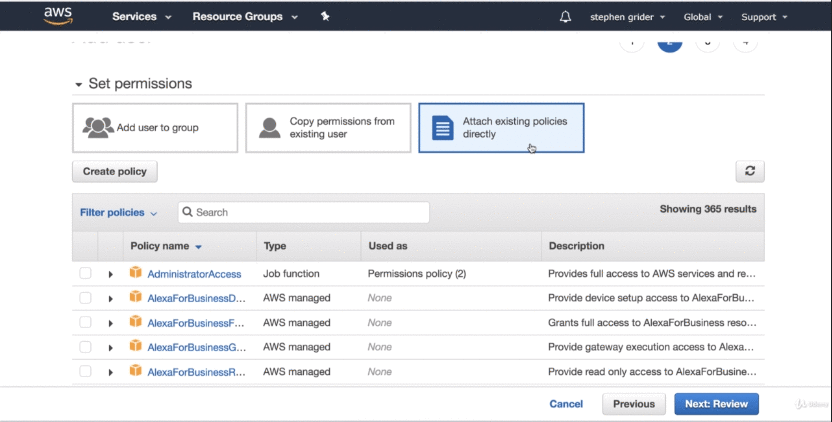

## 078. Travis Deploy Script

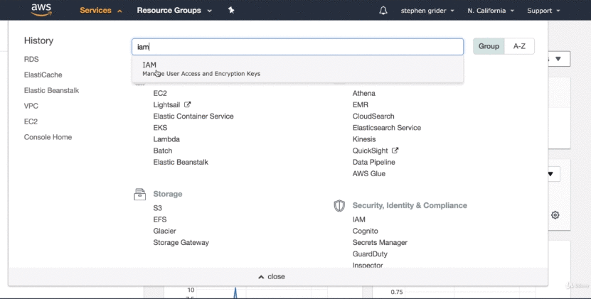

eg:
```yaml
# add this in .travis.yml

deploy:
  provider: elasticbeanstalk
  region: us-west-1
  app: multi-docker
  env: MultiDocker-env
  bucket_name: <your-bucket-name>
  bucket_path: docker-multi
  on:
    branch: master
  access_key_id: $AWS_ACCESS_KEY
  secret_access_key:
    secure: $AWS_SECRET_KEY
```

## 079. Container Memory Allocations

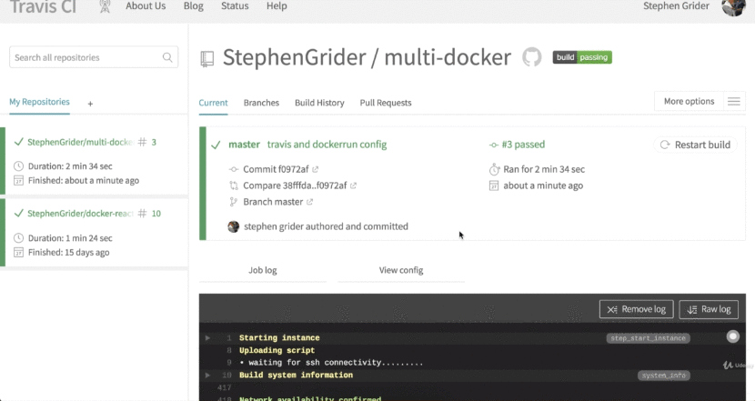

## 080. Cleaning Up AWS Resources

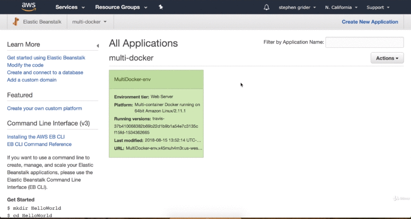

# == Kubernetes ==

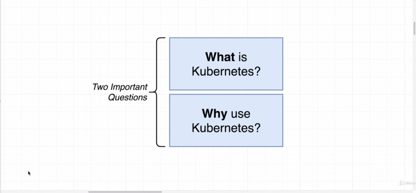

# What is Kubernetes?

Is a system for running many different containers over multiple different
machines

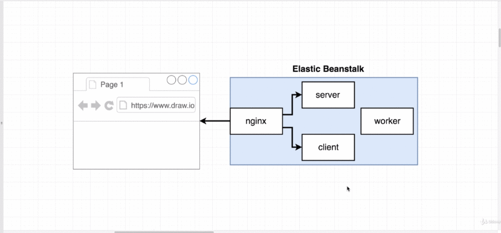

# Why use Kubernetes?

When you need to run many different containers with different images

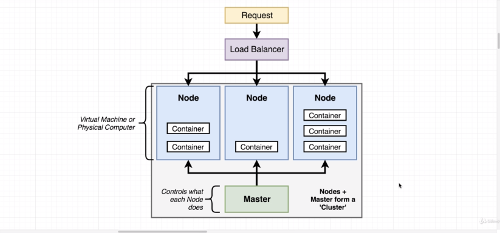

## 081. Kubernetes in Development and Production

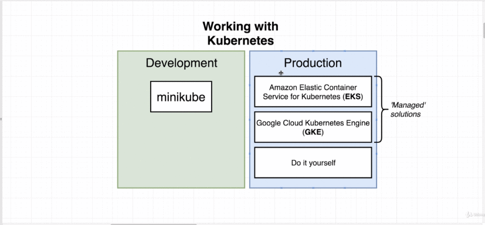

```
minikube  # a command line tools to setup a tiny kubernetes cluster

kubectl   # is a program use to interact kubernetes cluster in general
```

## 082. Mapping Existing Knowledge

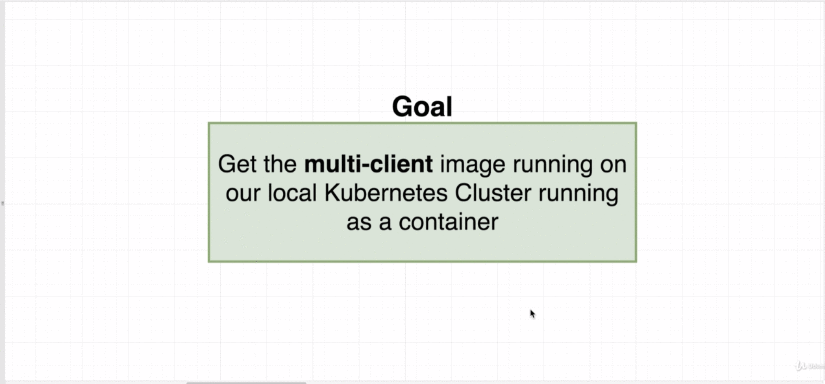

## 083. Adding Configuration file

```
k8s   # a convention term | abbervation for kubernetes
```
[client-pod.yaml](./simplek8s/client-pod.yaml)

[client-node-port.yaml](./simplek8s/client-node-port.yaml)

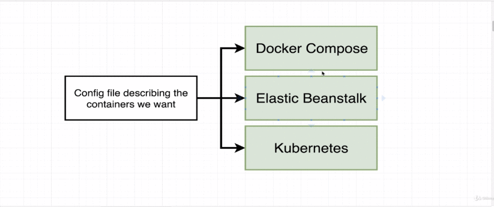

explanation config file

```
apiVersion: v1            # scope or limits the type of object
kind: Pod                 # a specific type of object
metadata: client-pod      # most of use is for logging purposes
  name: client-pod
  labels:
    component: web        # a label selector system to connect with client-node-port.yaml
```

when we make config file kubernetes we not quite making a **container** me make
something different we make an **object**.

**Q**: what is an object is on kubernetes?

**A**: a config file we set (make) the term object is refer to a **think** that
exist inside at kubernetes cluster, so we don't specifically says we make an
object so much, reality we make specific **type of object**

**Q**: what is an object use for on kubernetes?

**A**: object is essentially think that going to be created inside kuberntes cluster
to get application to work the way we might expect. Every object or type of
object have slightly different purpose

**Q**: what is Object types of Pod use for?

**A**: a Pod use to running a container

**Q**: what is object types ReplicaController use for?

**A**: a ReplicaController use for monitoring a container

**Q**: what is object types Service use for?

**A**: a Service use for up networking

## 084. Running Containers in Pods

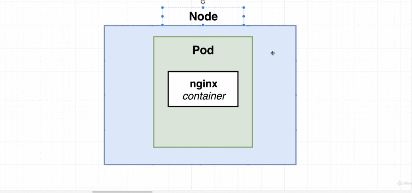

When we start to load-up the configuration file into **kubectl** is going to
create a **Pod** inside Virtual-Machine (we refer VM as a Node). A **Pod** it
self it's a grouping of containers with very common purpose.

**Q**: We might be wondering why me making a **Pod** that has a grouping a container?

**A**: In the kubernetes world there is no such think as just creating
a container on a cluster

back with **EB**, **docker-compose** we were creating containers really old-day
no shoe what so ever. In the world kubernetes we do not have the ability to just
run one naked single container by it self with no associated over had. The
smallest think you can deploy is a **Pod**.

It always to be declare or deploying containers within a **Pod**, as the
smallest think we can deploy to run a single container.

**Q**: why me make a **Pod**?

**A**: we cannot deploy individual containers by them self as we could with
docker-compose, DB requirement of a **Pod** we must run one or more containers
inside of it.

In the world of **Pod** we start to grouping together containers that have
a very discrete or very tightly couple relationship, in other words these
are containers absolutely have a tight immigration and must be executed with each
others.

## 085. Service Config Files in Depth

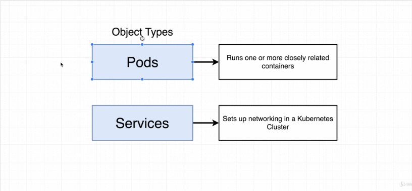

We use this Second object (**service**) types any times we want to setup some amount of
networking inside of kubernetes cluster.

eg:
```yaml
# client-node-port.yaml

apiVersion: V1
kind: Service
metadata:
  name: client-node-port
spec:
  types: NodePort
  ports:
    - port: 3050
      targetPort: 3000
      nodePort: 31515     # Expose a container to the outside world | for dev environment purpose
  selector:               # a label-selector-system
    component: web
```

```
kube-proxy      # a single window to the outside world
```
rather then referring to the **Service** to connect to the **client-pod.yaml**,
we instead using in kubernetes **label-selector-system**. To connect between
**client-node-port.yaml** with **client-pod.yaml**

A **component: web** is arbitrary key-value pair.

A **targetPort: 3000** is identical to the **containerPort: 3000** over the
**Pod** definition

A **nodePort** the most IMPORTANT is to communicated between developer to access
**multi-client Pod**


